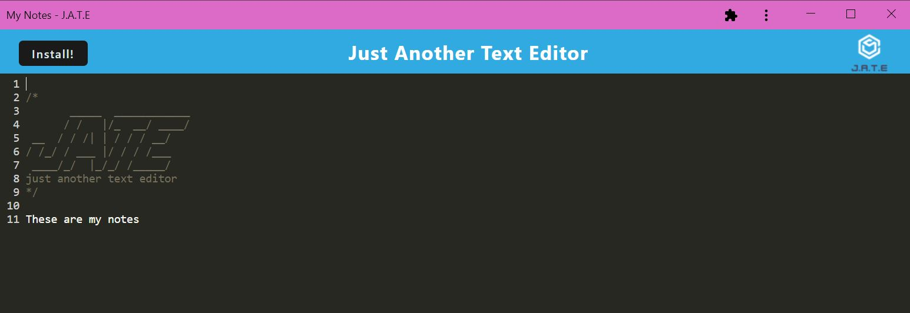

# Text Editor 

## Table of Contents
  [Description](#description) 
  [Installation](#installation) 
  [Usage](#usage) 
  [Credits](#credits) 
  [License](#license) 
  [Link to deployed application](#link-to-deployed-application) 
  [Website preview](#website-preview) 
  [Questions](#questions) 

## Description
Text Editor project is a web application that uses IndexedDB to store text that can be viewed and edited with or without internet connection. This application is also a installable Progressive Web App (PWA).\
This project is part of a challenge from Full Stack Coding Bootcamp at the University of Minnesota.
  
[Back to top](#text-editor-)

## Installation

If you wish to run this application locally, please use https://nodejs.org/en/ to install Node.js (version 16 is recommended).
Run `npm i` in the terminal to install dependencies.
  
[Back to top](#text-editor-)

## Usage
1. To use this Text Editor locally, follow these steps:
    1. Clone this project's repository to local machine by using SSH Key `git@github.com:BiaJorgensen/text-editor-pwa.git`
    1. Open a new Terminal
    1. Type `npm i` to guarantee dependencies are installed
    1. Type `npm run start` from the root directory
        * This will build the webpack and run the server
    1. The application should open in the browser using local host 3000
    1. Start adding notes or code snippets
    1. Click on the install button to download the web application on your desktop

1. To use the Heroku deployed version, follow these steps:
    1. Open https://bia-jorgensen-text-editor.herokuapp.com/
    1. Start adding notes or code snippets
    1. Click on the install button to download the web application on your desktop

  
[Back to top](#text-editor-)
 

## Credits

University of Minnesota - Full Stack Coding Bootcamp
  
[Back to top](#text-editor-)

## License

The license for this project is **The MIT License** 
To learn more about this license, please access https://opensource.org/licenses/MIT
  
[Back to top](#text-editor-)

## Link to deployed application

https://bia-jorgensen-text-editor.herokuapp.com/
  
[Back to top](#text-editor-)

## Website preview

<kbd></kbd>
  
[Back to top](#text-editor-)

## Questions
Visit my GitHub profile page: https://github.com/BiaJorgensen 
If you have additional questions, please send an email to souzabeatriz17@gmail.com
  
[Back to top](#text-editor-)